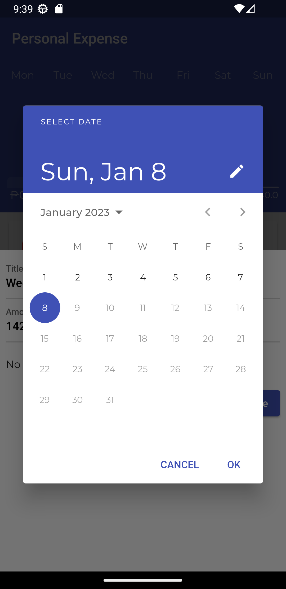

# Personal Expense

Your personal expense app to track daily spending and see total spending for the day.

## 📸 Screenshots

&nbsp &nbsp

&nbsp &nbsp

&nbsp &nbsp

## 📜 Description

This is my first Flutter project and one of the app project I enrolled in [Udemy](https://www.udemy.com/course/learn-flutter-dart-to-build-ios-android-apps/). I recreated the app project with enhanced design and new concepts I learned from the course.

## ⚙️ Features

- Track Expenses
- Add New Expenses
- Delete Expenses
- Daily Total Expenses Presented In Bar Chart
- Responsive

## 🖥️ Development

### Libraries
- [Provider](https://pub.dev/packages/provider)
- [Intl](https://pub.dev/packages/intl)

### Languages and Tools

   

## ✍️ Leasons Learned

By developing this application, I learned the basic concepts of Flutter such as Widgets, Stateless vs Statefull, Styles and Theming, and more. I improved the app by using state management - Provider, beautify the looks and feel of the app, and making the app responsive.

## 🧑‍🏫 Acknowledgments

- [Project Idea](https://www.udemy.com/course/learn-flutter-dart-to-build-ios-android-apps/)
- [UI Design](https://dribbble.com/shots/18325653-Doit-Expense-Management-App)

